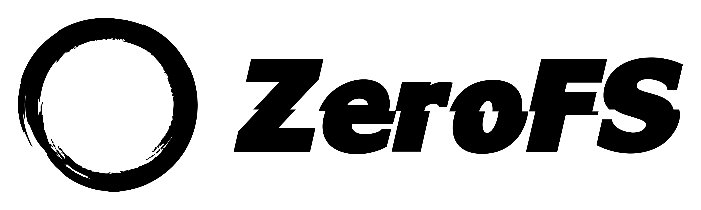

<p align="center">
  
</p>

# ZeroFS - The Filesystem That Makes S3 your Primary Storage
## File systems AND block devices on S3 storage

ZeroFS makes S3 storage feel like a real filesystem. Built on [SlateDB](https://github.com/slatedb/slatedb), it provides **file-level access via NFS and 9P** and **block-level access via NBD**. Fast enough to compile code on, with clients already built into your OS. No FUSE drivers, no kernel modules, just mount and go.

Join our community on Discord: https://discord.gg/eGKNQTbG

**Key Features:**
- **NFS Server** - Mount as a network filesystem on any OS
- **9P Server** - High-performance alternative with better POSIX semantics
- **NBD Server** - Access as raw block devices for ZFS, databases, or any filesystem
- **Always Encrypted** - ChaCha20-Poly1305 encryption with compression
- **High Performance** - Multi-layered caching with microsecond latencies
- **S3 Compatible** - Works with any S3-compatible storage

## Testing

ZeroFS passes all tests in the [pjdfstest_nfs](https://github.com/Barre/pjdfstest_nfs) test suite - 8,662 tests covering POSIX filesystem operations including file operations, permissions, ownership, and more.

We use ZFS as an end-to-end test in our CI. [We create ZFS pools on ZeroFS](https://github.com/Barre/ZeroFS/actions/workflows/zfs-test.yml), extract the Linux kernel source tree, and run scrub operations to verify data integrity. All operations complete without errors.

We also [compile the Linux kernel on ZeroFS](https://github.com/Barre/ZeroFS/actions/workflows/kernel-compile-9p.yml) as part of our CI, using parallel compilation (`make -j$(nproc)`) to stress-test concurrent operations.

## Demo

### Compiling the linux kernel on top of S3

Compiling the Linux Kernel in 16 seconds with a ZeroFS NBD volume + ZFS

<a href="https://asciinema.org/a/730946" target="_blank"></a>

### ZFS on S3 via NBD

ZeroFS provides NBD block devices that ZFS can use directly - no intermediate filesystem needed. Here's ZFS running on S3 storage:

<a href="https://asciinema.org/a/728234" target="_blank"></a>

### Ubuntu Running on ZeroFS

Watch Ubuntu boot from ZeroFS:

<p align="center">
<a href="https://asciinema.org/a/728172" target="_blank"></a>
</p>

### Self-Hosting ZeroFS

ZeroFS can self-host! Here's a demo showing Rust's toolchain building ZeroFS while running on ZeroFS:

<p align="center">
<a href="https://asciinema.org/a/728101" target="_blank"></a>
</p>

## Configuration

ZeroFS supports multiple access modes to the same S3-backed storage:

- **NFS Mode** - Traditional file-level access for general filesystem use
- **9P Mode** - High-performance file-level access with better POSIX FSYNC semantics
- **NBD Mode** - Block-level access for ZFS pools, databases, and raw storage applications

All modes share the same encrypted, compressed, cached storage backend.

You can also use ZeroFS with any supported object store backend by [object_store](https://crates.io/crates/object_store) crate.

You need to pass a URL as the argument to configure your backend, for example:
```bash
zerofs s3://bucket/path
```

Would use Amazon S3 backend for `slatedb` bucket. See [`object_store`'s documentation](https://docs.rs/object_store/0.12.3/object_store/enum.ObjectStoreScheme.html#supported-formats) for all supported formats.

### Required Environment Variables

- `SLATEDB_CACHE_DIR`: Directory path for SlateDB disk cache (required)
- `SLATEDB_CACHE_SIZE_GB`: SlateDB disk cache size in gigabytes (required, must be a positive number)
- `ZEROFS_ENCRYPTION_PASSWORD`: Password for filesystem encryption (required)

### Optional Environment Variables

You can configure your object store with optional set of environment variables depending on your backing implementation. For example, if you're using an Amazon S3 backend:

- `AWS_ENDPOINT`: S3-compatible endpoint URL
- `AWS_ACCESS_KEY_ID`: AWS access key ID
- `AWS_SECRET_ACCESS_KEY`: AWS secret access key
- `AWS_DEFAULT_REGION`: AWS region (default: `"us-east-1"`)
- `AWS_ALLOW_HTTP`: Allow HTTP connections (default: `"false"`)
- `ZEROFS_NFS_HOST`: Address (IP or hostname) to bind the NFS TCP socket (default: `"127.0.0.1"`)
- `ZEROFS_NFS_HOST_PORT`: Port to bind the NFS TCP socket (default: `2049`)
- `ZEROFS_NBD_HOST`: Address (IP or hostname) to bind the NBD TCP sockets (default: `"127.0.0.1"`)
- `ZEROFS_NBD_PORTS`: Comma-separated list of ports for NBD servers (optional)
- `ZEROFS_NBD_DEVICE_SIZES_GB`: Comma-separated list of device sizes in GB (optional, must match `ZEROFS_NBD_PORTS` count)
- `ZEROFS_MEMORY_CACHE_SIZE_GB`: Size of ZeroFS in-memory cache in GB (optional, default: 0.25GB)

See [Available `ObjectStore` Implementations](https://docs.rs/object_store/0.12.3/object_store/index.html#available-objectstore-implementations) for other environment variables.

### Encryption

Encryption is always enabled in ZeroFS. All file data is encrypted using ChaCha20-Poly1305 authenticated encryption with lz4 compression. A password is required to start the filesystem:

```bash
# Start ZeroFS with encryption password
ZEROFS_ENCRYPTION_PASSWORD='your-secure-password' zerofs s3://bucket/path
```

#### Password Management

On first run, ZeroFS generates a 256-bit data encryption key (DEK) and encrypts it with a key derived from your password using Argon2id. The encrypted key is stored in the database, so you need the same password for subsequent runs.

To change your password:

```bash
# Change the encryption password
ZEROFS_ENCRYPTION_PASSWORD='current-password' \
ZEROFS_NEW_PASSWORD='new-password' \
zerofs s3://bucket/path
```

The program will change the password and exit. Then you can use the new password for future runs.

#### What's Encrypted vs What's Not

**Encrypted:**
- All file contents (in 256K chunks)
- File metadata values (permissions, timestamps, etc.)

**Not Encrypted:**
- Key structure (inode IDs, directory entry names)
- Database structure (LSM tree levels, bloom filters)

This design is intentional. Encrypting keys would severely impact performance as LSM trees need to compare and sort keys during compaction. The key structure reveals filesystem hierarchy but not file contents.

This should be fine for most use-cases but if you need to hide directory structure and filenames, you can layer a filename-encrypting filesystem like gocryptfs on top of ZeroFS.

## Mounting the Filesystem

### 9P (Recommended for better performance and FSYNC POSIX semantics)

9P provides better performance and more accurate POSIX semantics, especially for fsync/commit operations. When fsync is called on 9P, ZeroFS receives a proper signal to flush data to stable storage, ensuring strong durability guarantees.

**Note on durability:** With NFS, ZeroFS reports writes as "stable" to the client even though they are actually unstable (buffered in memory/cache). This is done to avoid performance degradation, as otherwise each write would translate to an fsync-like operation (COMMIT in NFS terms). During testing, we expected clients to call COMMIT on FSYNC, but tested clients (macOS and Linux) don't follow this pattern. If you require strong durability guarantees, 9P is strongly recommended over NFS.

```bash
mount -t 9p -o trans=tcp,port=5564,version=9p2000.L,msize=1048576,cache=mmap,access=user 127.0.0.1 /mnt/9p
```

### NFS

#### macOS
```bash
mount -t nfs -o async,nolocks,rsize=1048576,wsize=1048576,tcp,port=2049,mountport=2049,hard 127.0.0.1:/ mnt
```

#### Linux
```bash
mount -t nfs -o async,nolock,rsize=1048576,wsize=1048576,tcp,port=2049,mountport=2049,hard 127.0.0.1:/ /mnt
```

## NBD Configuration and Usage

In addition to NFS, ZeroFS can provide raw block devices through NBD with full TRIM/discard support:

```bash
# Start ZeroFS with both NFS and NBD support
ZEROFS_ENCRYPTION_PASSWORD='your-password' \
ZEROFS_NBD_PORTS='10809,10810,10811' \
ZEROFS_NBD_DEVICE_SIZES_GB='1,2,5' \
zerofs s3://bucket/path

# Connect to NBD devices
nbd-client 127.0.0.1 10809 /dev/nbd0  # 1GB device
nbd-client 127.0.0.1 10810 /dev/nbd1  # 2GB device
nbd-client 127.0.0.1 10811 /dev/nbd2  # 5GB device

# Use the block devices
mkfs.ext4 /dev/nbd0
mount /dev/nbd0 /mnt/block

# Or create a ZFS pool
zpool create mypool /dev/nbd0 /dev/nbd1 /dev/nbd2
```

### TRIM/Discard Support

ZeroFS NBD devices support TRIM operations, which actually delete the corresponding chunks from the LSM-tree database backed by S3:

```bash
# Manual TRIM
fstrim /mnt/block

# Enable automatic discard (for filesystems)
mount -o discard /dev/nbd0 /mnt/block

# ZFS automatic TRIM
zpool set autotrim=on mypool
zpool trim mypool
```

When blocks are trimmed, ZeroFS removes the corresponding chunks from ZeroFS' LSM-tree, which eventually results in freed space in S3 storage through compaction. This reduces storage costs for any filesystem or application that issues TRIM commands.

### NBD Device Files

NBD devices appear as files in the `.nbd` directory when mounted via NFS:
- `.nbd/device_10809` - 1GB device accessible on port 10809
- `.nbd/device_10810` - 2GB device accessible on port 10810
- `.nbd/device_10811` - 5GB device accessible on port 10811

You can read/write these files directly through NFS, or access them as block devices through NBD.

**Important**: Once an NBD device is created with a specific size, the size cannot be changed. If you need to resize a device, you must delete the device file first:
```bash
# Delete existing device and recreate with new size
rm /mnt/zerofs/.nbd/device_10809
# Then restart ZeroFS with the new size
```

## Geo-Distributed Storage with ZFS

Since ZeroFS makes S3 regions look like local block devices, you can create globally distributed ZFS pools by running multiple ZeroFS instances across different regions:

```bash
# Terminal 1 - US East
ZEROFS_ENCRYPTION_PASSWORD='shared-key' \
AWS_DEFAULT_REGION=us-east-1 \
ZEROFS_NBD_PORTS='10809' \
ZEROFS_NBD_DEVICE_SIZES_GB='100' \
zerofs s3://my-bucket/us-east-db

# Terminal 2 - EU West
ZEROFS_ENCRYPTION_PASSWORD='shared-key' \
AWS_DEFAULT_REGION=eu-west-1 \
ZEROFS_NBD_PORTS='10810' \
ZEROFS_NBD_DEVICE_SIZES_GB='100' \
zerofs s3://my-bucket/eu-west-db

# Terminal 3 - Asia Pacific
ZEROFS_ENCRYPTION_PASSWORD='shared-key' \
AWS_DEFAULT_REGION=ap-southeast-1 \
ZEROFS_NBD_PORTS='10811' \
ZEROFS_NBD_DEVICE_SIZES_GB='100' \
zerofs s3://my-bucket/asia-db
```

Then connect to all three NBD devices and create a geo-distributed ZFS pool:

```bash
# Connect to NBD devices from each region
nbd-client 127.0.0.1 10809 /dev/nbd0 -N device_10809  # US East
nbd-client 127.0.0.2 10810 /dev/nbd1 -N device_10810  # EU West
nbd-client 127.0.0.3 10811 /dev/nbd2 -N device_10811  # Asia Pacific

# Create a mirrored pool across continents using raw block devices
zpool create global-pool mirror /dev/nbd0 /dev/nbd1 /dev/nbd2
```

**Result**: Your ZFS pool now spans three continents with automatic:

- **Disaster recovery** - If any region goes down, your data remains available
- **Geographic redundancy** - Data is simultaneously stored in multiple regions
- **Infinite scalability** - Add more regions by spinning up additional ZeroFS instances

This turns expensive geo-distributed storage infrastructure into a few simple commands.

## Tiered Storage with ZFS L2ARC

Since ZeroFS makes S3 behave like a regular block device, you can use ZFS's L2ARC to create automatic storage tiering:

```bash
# Create your S3-backed pool
zpool create mypool /dev/nbd0 /dev/nbd1

# Add local NVMe as L2ARC cache
zpool add mypool cache /dev/nvme0n1

# Check your setup
zpool iostat -v mypool
```

With this setup, ZFS automatically manages data placement across storage tiers:

1. NVMe L2ARC: for frequently accessed data
2. ZeroFS caches: Sub-millisecond latency for warm data
3. backend:for everything else

The tiering is transparent to applications. A PostgreSQL database sees consistent performance for hot data while storing years of historical data at S3 prices. No manual archival processes or capacity planning emergencies.

## PostgreSQL Performance

Here's pgbench running on PostgreSQL with ZeroFS + L2ARC as the storage backend:

### Read/Write Performance

```
postgres@ubuntu-16gb-fsn1-1:/root$ pgbench -c 50 -j 15 -t 100000 example
pgbench (16.9 (Ubuntu 16.9-0ubuntu0.24.04.1))
starting vacuum...end.
transaction type: <builtin: TPC-B (sort of)>
scaling factor: 50
query mode: simple
number of clients: 50
number of threads: 15
maximum number of tries: 1
number of transactions per client: 100000
number of transactions actually processed: 5000000/5000000
number of failed transactions: 0 (0.000%)
latency average = 0.943 ms
initial connection time = 48.043 ms
tps = 53041.006947 (without initial connection time)
```
### Read-Only Performance

```
postgres@ubuntu-16gb-fsn1-1:/root$ pgbench -c 50 -j 15 -t 100000 -S example
pgbench (16.9 (Ubuntu 16.9-0ubuntu0.24.04.1))
starting vacuum...end.
transaction type: <builtin: select only>
scaling factor: 50
query mode: simple
number of clients: 50
number of threads: 15
maximum number of tries: 1
number of transactions per client: 100000
number of transactions actually processed: 5000000/5000000
number of failed transactions: 0 (0.000%)
latency average = 0.121 ms
initial connection time = 53.358 ms
tps = 413436.248089 (without initial connection time)
```

These are standard pgbench runs with 50 concurrent clients. The underlying data is stored in S3, with hot data served from L2ARC and ZeroFS caches. Performance is comparable to local NVMe while the actual data resides in S3 at $0.023/GB/month.

### Example architecture

```
                         PostgreSQL Client
                                   |
                                   | SQL queries
                                   |
                            +--------------+
                            |  PG Proxy    |
                            | (HAProxy/    |
                            |  PgBouncer)  |
                            +--------------+
                               /        \
                              /          \
                   Synchronous            Synchronous
                   Replication            Replication
                            /              \
                           /                \
              +---------------+        +---------------+
              | PostgreSQL 1  |        | PostgreSQL 2  |
              | (Primary)     |◄------►| (Standby)     |
              +---------------+        +---------------+
                      |                        |
                      |  POSIX filesystem ops  |
                      |                        |
              +---------------+        +---------------+
              |   ZFS Pool 1  |        |   ZFS Pool 2  |
              | (3-way mirror)|        | (3-way mirror)|
              +---------------+        +---------------+
               /      |      \          /      |      \
              /       |       \        /       |       \
        NBD:10809 NBD:10810 NBD:10811  NBD:10812 NBD:10813 NBD:10814
             |        |        |           |        |        |
        +--------++--------++--------++--------++--------++--------+
        |ZeroFS 1||ZeroFS 2||ZeroFS 3||ZeroFS 4||ZeroFS 5||ZeroFS 6|
        +--------++--------++--------++--------++--------++--------+
             |         |         |         |         |         |
             |         |         |         |         |         |
        S3-Region1 S3-Region2 S3-Region3 S3-Region4 S3-Region5 S3-Region6
        (us-east) (eu-west) (ap-south) (us-west) (eu-north) (ap-east)
```

## Why NFS and 9P?

We support both NFS and 9P because they offer complementary advantages for network filesystems:

**NFS** is supported everywhere - macOS, Linux, Windows, BSD - without requiring any additional software. The client-side kernel implementation is highly optimized, while our server can remain in userspace with full control over the storage backend. NFS's network-first design is a natural fit for remote object storage. The protocol handles disconnections, retries, and caching in ways that have been refined over decades of production use.

**9P** provides superior performance and more accurate POSIX semantics, particularly for fsync/commit operations. Originally developed for Plan 9, it has a cleaner, simpler protocol design that's easier to implement correctly.

Both protocols share key advantages over FUSE:
- No custom kernel modules or drivers needed
- Battle-tested client implementations in every OS
- Network-first design ideal for remote storage
- Built-in handling of disconnections and retries
- Standard mounting and monitoring tools

With FUSE, we'd need to write both the filesystem implementation and a custom client driver to handle S3's network characteristics properly - latency, retries, caching strategies. NFS and 9P let us focus on what matters: building a great filesystem. The networking, caching, and client-side concerns are handled by mature implementations in every OS kernel.

For developers, this means you can mount ZeroFS using standard OS tools, monitor it with existing infrastructure, and debug issues with familiar utilities. Choose NFS for maximum compatibility, or 9P for maximum performance and POSIX FSYNC accuracy.


## Performance Benchmarks

### SQLite Performance

ZeroFS delivers excellent performance for database workloads. Here are SQLite benchmark results running on ZeroFS:

```
SQLite:     version 3.25.2
Date:       Wed Jul 16 12:08:22 2025
CPU:        8 * AMD EPYC-Rome Processor
CPUCache:   512 KB
Keys:       16 bytes each
Values:     100 bytes each
Entries:    1000000
RawSize:    110.6 MB (estimated)
------------------------------------------------
fillseq      :      19.426 micros/op;
readseq      :       0.941 micros/op;
readrand100K :       1.596 micros/op;
```

These microsecond-level latencies are 4-5 orders of magnitude faster than raw S3 operations (which typically have 50-300ms latency). This performance is achieved through:

- Multi-layered cache: Memory block cache, metadata cache, and configurable disk cache
- Compression: Reduces data transfer and increases effective cache capacity
- Parallel prefetching: Overlaps S3 requests to hide latency
- Buffering through WAL + memtables: Batches writes to minimize S3 operations

<p align="center">
  <a href="https://asciinema.org/a/ovxTV0zTpjE1xcxn5CXehCTTN" target="_blank">View SQLite Benchmark Demo</a>
</p>

## Key Differences from S3FS

### 1. **Storage Architecture**

**S3FS:**
- Maps filesystem operations directly to S3 object operations
- Each file is typically stored as a single S3 object
- Directories are often represented as zero-byte objects with trailing slashes
- Metadata stored in S3 object headers or separate metadata objects

**ZeroFS:**
- Uses SlateDB, a log-structured merge-tree (LSM) database
- Files are chunked into 256K blocks for efficient S3 operations
- Inodes and file data stored as key-value pairs
- Metadata is first-class data in the database

### 2. **Performance Characteristics**

**S3FS:**
- High latency for small file operations (S3 API overhead)
- Poor performance for partial file updates (must rewrite entire object)
- Directory listings can be slow (S3 LIST operations)
- No real atomic operations across multiple files

**ZeroFS:**
- Optimized for small, random I/O operations
- Efficient partial file updates through chunking
- Fast directory operations using B-tree indexes
- Atomic batch operations through SlateDB's WriteBatch

### 3. **Data Layout**

**S3FS Layout:**
```
s3://bucket/
├── file1.txt (complete file as single object)
├── dir1/ (zero-byte marker)
├── dir1/file2.txt (complete file)
└── .metadata/ (optional metadata storage)
```

**ZeroFS Layout (in SlateDB):**
```
Key-Value Store:
├── inode:0 → {type: directory, entries: {...}}
├── inode:1 → {type: file, size: 1024, ...}
├── chunk:1/0 → [first 256K of file data]
├── chunk:1/1 → [second 256K of file data]
└── next_inode_id → 2
```

### 5. **Cost Model**

**S3FS:**
- Costs scale with number of API requests
- Full file rewrites expensive for small changes
- LIST operations can be costly for large directories

**ZeroFS:**
- Costs amortized through SlateDB's compaction
- Efficient small updates reduce write amplification
- Predictable costs through batching

## GitHub Action

ZeroFS is available as a GitHub Action for easy integration into your CI/CD workflows:

```yaml
- uses: Barre/zerofs@v1
  with:
    object-store-url: 's3://bucket/path'
    encryption-password: ${{ secrets.ZEROFS_PASSWORD }}
    aws-access-key-id: ${{ secrets.AWS_ACCESS_KEY_ID }}
    aws-secret-access-key: ${{ secrets.AWS_SECRET_ACCESS_KEY }}
```

This enables persistent storage across workflow runs, shared artifacts between jobs, and more.

## Filesystem Limits

ZeroFS has the following theoretical limits:

- **Maximum file size**: 16 EB (exabytes) per file
- **Maximum number of files**: 281 trillion (2^48)
- **Maximum hardlinks per file**: 65,535 (across all directories)
- **Maximum filesystem size**: 4,096 geopbytes (2^112 bytes)
  - = 4 million yottabytes  
  - = 4 billion zettabytes
  - = 4 trillion exabytes

These limits come from the filesystem design:
- File IDs use 48 bits for the inode number and 16 bits for hardlink position
- File sizes are stored as 64-bit integers
- The chunking system uses 256KB blocks with 64-bit indexing

In practice, you'll encounter other constraints well before these theoretical limits, such as S3 provider limits, performance considerations with billions of objects, or simply running out of money.

## Future Enhancements

- [ ] Snapshot capabilities using SlateDB's checkpoints
