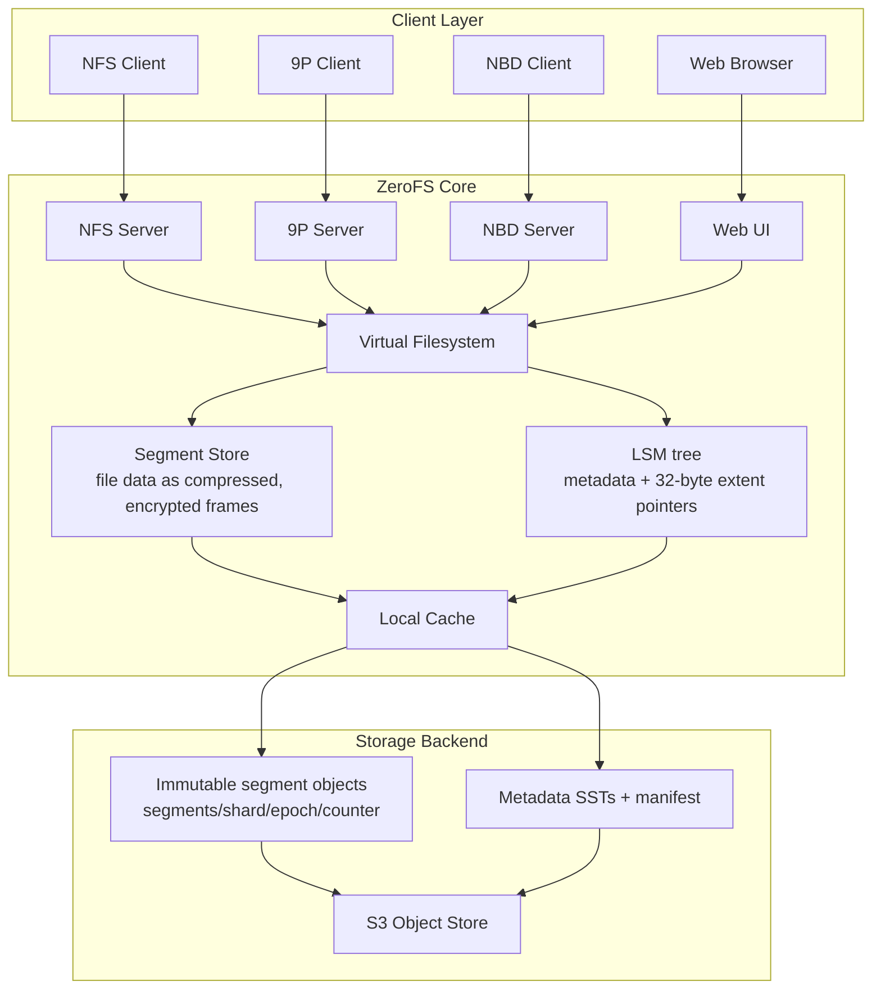

<p align="center">
  <a href="https://www.zerofs.net">
    
  </a>
</p>

<div align="center">


**[Documentation](https://www.zerofs.net)** | **[Quickstart](https://www.zerofs.net/quickstart)**

</div>

# ZeroFS is a log-structured filesystem for S3

ZeroFS serves S3-compatible buckets as POSIX filesystems over NFS and 9P, and as raw block devices over NBD. All three servers run in a single userspace process. Data is compressed and encrypted before upload.

ZeroFS differentiates itself from other "filesystem on S3" projects by:

- Being POSIX-conformant
- Reaching near-raw-S3 throughput on large files, and scaling to workloads of hundreds of millions of small files
- Handling tens of thousands of requests per second
- Requiring no external database service (everything is stored on S3)
- Being well tested (in CI we run [pjdfstest](https://github.com/Barre/ZeroFS/actions/workflows/ci.yml), [xfstests](https://github.com/Barre/ZeroFS/actions/workflows/ci.yml), [kernel builds](https://github.com/Barre/ZeroFS/actions/workflows/ci.yml), [stress-ng](https://github.com/Barre/ZeroFS/actions/workflows/ci.yml), [ZFS](https://github.com/Barre/ZeroFS/actions/workflows/ci.yml), [Jepsen local-fs](https://github.com/Barre/ZeroFS/actions/workflows/ci.yml), [Jepsen HA](https://github.com/Barre/ZeroFS/actions/workflows/ci.yml), and more)


| | |
|---|---|
| **File access** | NFS and 9P servers. `zerofs mount`, the bundled FUSE client, is the recommended Linux mount. |
| **Block access** | NBD devices with TRIM. FLUSH and FUA replies return only after data is durable. |
| **Encryption** | Extents are encrypted with XChaCha20-Poly1305. Data key wrapped via Argon2id. |
| **Compression** | zstd or lz4, before encryption. Codec changeable at any time without migration. |
| **Caching** | Memory and disk tiers. |
| **High availability** | Optional leader/standby over the same bucket for automatic failover. |
| **Web UI** | File manager, dashboard, in-browser terminal. |
| **Backends** | Amazon S3, Google Cloud Storage, Azure Blob, any S3-compatible store, local disk. |

## Quick Start

### apt / dnf

```bash
# Debian / Ubuntu
curl -fsSL https://pkgs.zerofs.net/zerofs.gpg | sudo gpg --dearmor -o /usr/share/keyrings/zerofs.gpg
echo "deb [signed-by=/usr/share/keyrings/zerofs.gpg] https://pkgs.zerofs.net/deb stable main" | sudo tee /etc/apt/sources.list.d/zerofs.list
sudo apt update && sudo apt install zerofs

# Fedora / RHEL / Rocky
curl -fsSL https://pkgs.zerofs.net/zerofs.repo | sudo tee /etc/yum.repos.d/zerofs.repo
sudo dnf install zerofs
```

Packages also install a systemd service (`zerofs.service`, disabled by default) and a config skeleton under `/etc/zerofs/`. Set `ZEROFS_PASSWORD` and credentials in `/etc/zerofs/zerofs.env`, the `[storage]` url in `/etc/zerofs/config.toml`, then `sudo systemctl enable --now zerofs`. Details: [packaging/README.md](packaging/README.md).

### Install script

```bash
curl -sSfL https://sh.zerofs.net | sh

# Pin a release and install without root
curl -sSfL https://sh.zerofs.net | VERSION=v1.2.5 INSTALL_DIR=$HOME/.local/bin sh
```

Downloads the release tarball, verifies the published SHA-256 checksum, and installs the prebuilt binary: Linux (amd64, arm64), macOS (x86_64, aarch64), FreeBSD (amd64). Full matrix: [quickstart](https://www.zerofs.net/quickstart#installation).

### Docker

```bash
docker pull ghcr.io/barre/zerofs:latest

# Generate a starter config on the host ("-" writes to stdout)
docker run --rm ghcr.io/barre/zerofs:latest init - > zerofs.toml

$EDITOR zerofs.toml
docker run --rm -v "$PWD/zerofs.toml:/zerofs.toml" \
  ghcr.io/barre/zerofs:latest run -c /zerofs.toml
```

The container runs as UID 1001. A bind-mounted cache directory must be writable by UID 1001. To reach the servers from the host, bind addresses to `0.0.0.0` and map a port per enabled server: 2049 (NFS), 5564 (9P), 10809 (NBD).

### Running

```bash
zerofs init            # Generate zerofs.toml
$EDITOR zerofs.toml    # Set S3 credentials
zerofs run -c zerofs.toml
```


## Testing

- **[pjdfstest](https://github.com/Barre/ZeroFS/actions/workflows/ci.yml)**: 8,662 POSIX cases ([pjdfstest_nfs](https://github.com/Barre/pjdfstest_nfs)), once per protocol: NFS, 9P, FUSE. Per-protocol exclude lists are in [`.github/`](https://github.com/Barre/ZeroFS/tree/main/.github).
- **[xfstests](https://github.com/Barre/ZeroFS/actions/workflows/ci.yml)**: the standard filesystem regression suite, over NFS, 9P, and FUSE.
- **[Kernel build](https://github.com/Barre/ZeroFS/actions/workflows/ci.yml)**: the Linux kernel compiles with `make -j$(nproc)` on NFS, 9P, and FUSE mounts.
- **[stress-ng](https://github.com/Barre/ZeroFS/actions/workflows/ci.yml)**: file-handling stressors run concurrently against live mounts.
- **[ZFS](https://github.com/Barre/ZeroFS/actions/workflows/ci.yml)**: a ZFS pool on ZeroFS block devices; kernel source extraction, then a scrub.
- **[Jepsen local-fs](https://github.com/Barre/ZeroFS/actions/workflows/ci.yml)**: random operation histories against a 9P mount, checked against a reference model ([local-fs](https://github.com/jepsen-io/local-fs)). A crash mode kills the server mid-run and verifies recovery matches the last fsync.
- **[Jepsen HA](https://github.com/Barre/ZeroFS/actions/workflows/ci.yml)**: a leader/standby pair over MinIO under a nemesis that kills or pauses nodes; no acknowledged write may be lost, resurrected, or corrupted across failover. The local-fs model checker also runs with failovers injected.
- **[Deterministic simulation](https://github.com/Barre/ZeroFS/actions/workflows/rust.yml)**: the data plane runs in a simulated world ([`zerofs/tests/dst`](https://github.com/Barre/ZeroFS/tree/main/zerofs/tests/dst)): virtual time, seeded storage latencies deciding every task interleaving, seeded transient store faults, and crashes placed at arbitrary await points or, via failpoints, inside specific narrow windows, with recovery checked against a reference model. One seed is one exact schedule, so a failing seed reproduces identically.

## Web UI

```toml
[servers.webui]
addresses = ["127.0.0.1:8080"]
uid = 1000  # POSIX identity for file operations from the browser; required
gid = 1000  # Required
```
<p align="center">
    
</p>

The file manager speaks 9P over WebSocket. Drag-and-drop uploads work, including entire folders.

<p align="center">
    
</p>

The dashboard streams stats over gRPC-web, plus a file access tracer.

<p align="center">
    
</p>

The terminal boots a Linux VM via [v86](https://github.com/copy/v86), with the filesystem at `/mnt` over the same 9P WebSocket. The guest has no network device.

## Architecture

The NFS, 9P, and NBD servers and the Web UI share a single filesystem layer. File contents are split into 32 KiB extents; each extent is compressed, encrypted, and packed as a frame into immutable segment objects (up to 256 MiB). Metadata (inodes, directory entries, and one 32-byte pointer per extent) lives in an LSM-tree database on the same object store. [architecture documentation](https://www.zerofs.net/architecture).


```mermaid
graph TB
    subgraph "Client Layer"
        NFS[NFS Client]
        P9[9P Client]
        NBD[NBD Client]
        WEB[Web Browser]
    end

    subgraph "ZeroFS Core"
        NFSD[NFS Server]
        P9D[9P Server]
        NBDD[NBD Server]
        WEBUI[Web UI]
        VFS[Virtual Filesystem]
        SEG[Segment Store<br/>file data as compressed, encrypted frames]
        SLATE[LSM tree<br/>metadata + 32-byte extent pointers]
        CACHE[Local Cache]

        NFSD --> VFS
        P9D --> VFS
        NBDD --> VFS
        WEBUI --> VFS
        VFS --> SEG
        VFS --> SLATE
        SEG --> CACHE
        SLATE --> CACHE
    end

    subgraph "Storage Backend"
        SEGOBJ[Immutable segment objects<br/>segments/shard/epoch/counter]
        SSTS[Metadata SSTs + manifest]
        S3[S3 Object Store]

        CACHE --> SEGOBJ
        CACHE --> SSTS
        SEGOBJ --> S3
        SSTS --> S3
    end

    NFS --> NFSD
    P9 --> P9D
    NBD --> NBDD
    WEB --> WEBUI
```


## High Availability

A `[replication]` section runs a leader and a standby backed by the same bucket; there is no second copy of the data to provision. The standby semi-synchronously replicates acknowledged-but-unflushed writes and takes over in seconds if the leader fails. Writer-epoch fencing prevents split-brain: a deposed leader cannot commit. Design, guarantees, configuration: [high availability](https://www.zerofs.net/high-availability).

## Configuration

TOML with `$VAR`/`${VAR}` environment substitution; all referenced variables must be set. `[cache]`, `[storage]`, and `[servers]` are required. Full option reference: [Configuration Guide](https://www.zerofs.net/configuration).

```toml
[cache]
dir = "${HOME}/.cache/zerofs"
disk_size_gb = 10.0
memory_size_gb = 1.0  # Optional, defaults to 0.25

[storage]
url = "s3://my-bucket/zerofs-data"
encryption_password = "${ZEROFS_PASSWORD}"

[filesystem]
max_size_gb = 100.0     # Optional; writes past the quota return ENOSPC (default 16 EiB)
compression = "zstd-3"  # Optional: "zstd-{1-22}" (default "zstd-3") or "lz4"

[servers.nfs]
addresses = ["127.0.0.1:2049"]

[servers.ninep]
addresses = ["127.0.0.1:5564"]
unix_socket = "/tmp/zerofs.9p.sock"  # Optional

[servers.nbd]
addresses = ["127.0.0.1:10809"]
unix_socket = "/tmp/zerofs.nbd.sock"  # Optional

[servers.rpc]
addresses = ["127.0.0.1:7000"]  # Needed by zerofs checkpoint, flush, monitor, fatrace, otrace

[aws]
access_key_id = "${AWS_ACCESS_KEY_ID}"
secret_access_key = "${AWS_SECRET_ACCESS_KEY}"
# endpoint = "https://s3.us-east-1.amazonaws.com"  # For S3-compatible services
# default_region = "us-east-1"
# allow_http = "true"  # For non-HTTPS endpoints (e.g., MinIO)
# conditional_put = "redis://localhost:6379"  # For stores without conditional-put support
```

### Backends

```toml
url = "s3://bucket/path"        # + [aws] credentials
url = "azure://container/path"  # + [azure] storage_account_name / storage_account_key
url = "gs://bucket/path"        # + [gcp] service_account, or ambient ADC on GCP VMs/GKE
url = "file:///path/to/storage" # Local disk; no credentials
```

Further schemes (`s3a://`, `abfs://`, host-routed `https://`, `memory://`): [Configuration Guide](https://www.zerofs.net/configuration).

ZeroFS requires conditional writes (put-if-not-exists) for fencing. AWS S3 supports this natively; for stores that don't, set `conditional_put` to a Redis URL.

An optional `storage_class` under `[storage]` is passed verbatim to the backend (S3 `x-amz-storage-class`, GCS `x-goog-storage-class`, Azure `x-ms-access-tier`). Use a hot, standard-access class: archive tiers render the volume unusable, and infrequent-access tiers charge retrieval on ZeroFS's constant reads, usually costing more.


## Mounting

Over 9P, fsync returns only after data reaches stable storage; NFS COMMIT semantics let fsync return before that. If you depend on fsync durability, use a 9P-based mount.

### `zerofs mount` (recommended on Linux)

```bash
zerofs mount 127.0.0.1:5564 /mnt/zerofs        # TCP
zerofs mount /tmp/zerofs.9p.sock /mnt/zerofs   # Unix socket
```

### Kernel 9P client


```bash
mount -t 9p -o trans=tcp,port=5564,version=9p2000.L,cache=mmap,access=user 127.0.0.1 /mnt/9p
# Unix socket
mount -t 9p -o trans=unix,version=9p2000.L,cache=mmap,access=user /tmp/zerofs.9p.sock /mnt/9p
```

### NFS

ZeroFS reports NFS writes as stable while they are buffered; tested clients (macOS, Linux) do not send COMMIT on fsync. Use a 9P mount where fsync durability matters.

```bash
# macOS
mount -t nfs -o async,nolocks,rsize=1048576,wsize=1048576,tcp,port=2049,mountport=2049,hard 127.0.0.1:/ mnt
# Linux
mount -t nfs -o async,nolock,rsize=1048576,wsize=1048576,tcp,port=2049,mountport=2049,hard 127.0.0.1:/ /mnt
```

Mount options, persistent mounts, Windows: [NFS access](https://www.zerofs.net/nfs-access).

## NBD Block Devices

Device files in a `.nbd` directory attach as raw block devices:

```bash
# Create devices through any file mount
mkdir -p /mnt/zerofs/.nbd
truncate -s 1G /mnt/zerofs/.nbd/device1

# Connect (recommended: -persist, -timeout 600 for S3 latency, -connections 4)
nbd-client 127.0.0.1 10809 /dev/nbd0 -N device1 -persist -timeout 600 -connections 4
# Unix socket
nbd-client -unix /tmp/zerofs.nbd.sock /dev/nbd1 -N device1 -persist -timeout 600 -connections 4

mkfs.ext4 /dev/nbd0
# or
zpool create mypool /dev/nbd0
```

The handshake advertises FLUSH, FUA, and multi-connection support. FLUSH and FUA replies return only after data is durable, and a FLUSH on any connection covers all connections, so write barriers hold for ZFS pools and databases. Details: [NBD devices](https://www.zerofs.net/nbd-devices).

New device files are picked up at runtime. Sizes are fixed at creation: to resize, disconnect, delete, and recreate. To remove a device, disconnect the client (`nbd-client -d /dev/nbd0`), then `rm` the file.

### TRIM

```bash
fstrim /mnt/block                    # Manual
mount -o discard /dev/nbd0 /mnt/block  # Automatic (filesystems)
zpool set autotrim=on mypool         # Automatic (ZFS)
```

TRIM deletes extent pointers and debits each segment's live-byte counter; a GC pass every 60 seconds deletes dead segments and repacks fragmented ones, reclaiming the space in S3.

## Limits

- Maximum file size: 16 EiB
- Maximum filesystem size: 16 EiB
- Files over the filesystem lifespan: 2^64
- Hardlinks per file: 2^32

Format limits (64-bit inode and size fields, 32 KiB extents), not tested ones; provider limits and storage cost take effect first. See [architecture](https://www.zerofs.net/architecture).

## Licensing

Dual-licensed under the GNU AGPL v3 (fully featured, for open source use) and a [commercial license](https://www.zerofs.net/licensing).
