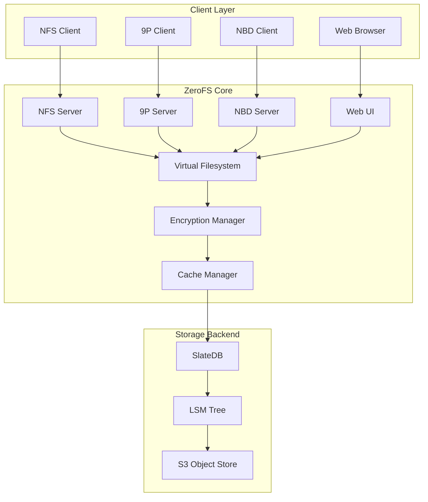

<p align="center">
  <a href="https://www.zerofs.net">
    
  </a>
</p>

<div align="center">


<a href="https://discord.gg/5PxcuUeaaT"></a>


**[Documentation](https://www.zerofs.net)** | **[Quickstart](https://www.zerofs.net/quickstart)** | **[ZeroFS vs AWS EFS](https://www.zerofs.net/zerofs-vs-aws-efs)**

</div>

# ZeroFS — Make S3 your primary storage

ZeroFS serves S3-compatible buckets as **POSIX filesystems over NFS and 9P**, and as **raw block devices over NBD**. All three servers run in one userspace process. Data is compressed and encrypted before upload.


**Key Features:**
- **NFS Server** - Mount as a network filesystem; every major OS ships an NFS client
- **9P Server** - File-level access with stricter POSIX semantics; fsync returns only after data reaches stable storage
- **Userspace Client** - `zerofs mount`, the recommended Linux mount; speaks 9P to the server, mounts without root, reconnects on its own
- **NBD Server** - Access as raw block devices for ZFS, databases, or any filesystem
- **Web UI** - File manager, real-time monitoring, and in-browser terminal
- **Always Encrypted** - Data is compressed (zstd or LZ4), then encrypted with XChaCha20-Poly1305 before upload; there is no unencrypted mode
- **Local Cache** - Warm cached random reads in 1.6 µs (SQLite bench); a raw S3 round trip is 50–300 ms
- **High Availability** - Optional leader/standby replication with automatic failover; a connected standby preserves writes that were acknowledged but not yet flushed to object storage
- **Backends** - AWS S3, Google Cloud Storage, Azure Blob, any S3-compatible store, or local disk

## Testing

ZeroFS runs the [pjdfstest_nfs](https://github.com/Barre/pjdfstest_nfs) suite in CI on every change — 8,662 tests covering POSIX filesystem operations including file operations, permissions, and ownership — once per protocol: [NFS](https://github.com/Barre/ZeroFS/actions/workflows/ci.yml), [9P](https://github.com/Barre/ZeroFS/actions/workflows/ci.yml), and [FUSE](https://github.com/Barre/ZeroFS/actions/workflows/ci.yml). A few cases per protocol are excluded; the lists are published in [`.github/`](https://github.com/Barre/ZeroFS/tree/main/.github).

CI also runs Jepsen's [local-fs](https://github.com/jepsen-io/local-fs) suite against a 9P mount, via [a workflow](https://github.com/Barre/ZeroFS/actions/workflows/ci.yml) that assembles it. It generates random filesystem-operation histories and checks each against a reference model, shrinking any divergence to a minimal failing case. A second mode injects a crash: it kills the server mid-run, dropping the un-fsynced memtable, and verifies the state recovered from the object store is consistent with the last fsync.

CI also exercises HA: the same local-fs model-checker runs with leader-to-standby failovers injected, and a separate [classic-Jepsen suite](https://github.com/Barre/ZeroFS/actions/workflows/ci.yml) runs a leader/standby pair over MinIO under a nemesis that kills the leader, the standby, or both, or pauses MinIO, checking that no acknowledged write is lost, resurrected, or corrupted across a failover.

We use ZFS as an end-to-end test in our CI. [We create ZFS pools on ZeroFS](https://github.com/Barre/ZeroFS/actions/workflows/ci.yml), extract the Linux kernel source tree, and run scrub operations to verify data integrity. The scrub reports no checksum errors.

We also [compile the Linux kernel on ZeroFS](https://github.com/Barre/ZeroFS/actions/workflows/ci.yml) as part of our CI — separately over NFS, 9P, and FUSE — using parallel compilation (`make -j$(nproc)`) to stress-test concurrent operations. CI also runs [xfstests](https://github.com/Barre/ZeroFS/actions/workflows/ci.yml) over all three protocols and [stress-ng](https://github.com/Barre/ZeroFS/actions/workflows/ci.yml) filesystem stressors against live mounts.

## Demo

### Compiling the Linux kernel on top of S3

Compiling the Linux kernel in 16 seconds with a ZeroFS NBD volume + ZFS (recorded session):

<a href="https://asciinema.org/a/730946" target="_blank"></a>

### ZFS on S3 via NBD

ZeroFS provides NBD block devices that ZFS can use directly - no intermediate filesystem needed. Here's ZFS running on S3 storage:

<a href="https://asciinema.org/a/728234" target="_blank"></a>

### Ubuntu Running on ZeroFS

Ubuntu booting from ZeroFS:

<p align="center">
<a href="https://asciinema.org/a/728172" target="_blank"></a>
</p>

### Self-Hosting ZeroFS

The Rust toolchain builds ZeroFS on a filesystem that ZeroFS itself is serving:

<p align="center">
<a href="https://asciinema.org/a/728101" target="_blank"></a>
</p>

## Web UI

ZeroFS includes a web interface ([documentation](https://www.zerofs.net/web-ui)). Add this to your config:

```toml
[servers.webui]
addresses = ["127.0.0.1:8080"]
uid = 1000
gid = 1000
```

`uid` and `gid` set the POSIX identity for all file operations from the Web UI; both are required. The Web UI has no authentication on any route, so keep the bind address on loopback or a trusted network — see [security considerations](https://www.zerofs.net/web-ui#security-considerations). Prebuilt release binaries and the Docker image include the Web UI; a plain `cargo build` does not.

<p align="center">
    
  </p>

The file manager talks to ZeroFS over 9P via WebSocket. Drag-and-drop uploads work, including entire folders.

<p align="center">
    
  </p>


The dashboard streams live stats (throughput, IOPS, storage usage, operation counters, GC) over gRPC-web, plus a file access tracer showing recent operations.

<p align="center">
    
  </p>

The terminal runs a Linux VM in the browser using [v86](https://github.com/copy/v86). The guest mounts the ZeroFS filesystem at `/mnt` over the same 9P WebSocket; the guest has no network device, so files move in and out only through the mount.

## Architecture

The NFS, 9P, and NBD servers and the Web UI run in one userspace process and share a single filesystem layer. Data passes through encryption and caching and is stored in S3 as an LSM tree. The [architecture documentation](https://www.zerofs.net/architecture) covers protocol choice and filesystem limits.


```mermaid

graph TB
    subgraph "Client Layer"
        NFS[NFS Client]
        P9[9P Client]
        NBD[NBD Client]
        WEB[Web Browser]
    end
    
    subgraph "ZeroFS Core"
        NFSD[NFS Server]
        P9D[9P Server]
        NBDD[NBD Server]
        WEBUI[Web UI]
        VFS[Virtual Filesystem]
        ENC[Encryption Manager]
        CACHE[Cache Manager]
        
        NFSD --> VFS
        P9D --> VFS
        NBDD --> VFS
        WEBUI --> VFS
        VFS --> ENC
        ENC --> CACHE
    end
    
    subgraph "Storage Backend"
        SLATE[SlateDB]
        LSM[LSM Tree]
        S3[S3 Object Store]
        
        CACHE --> SLATE
        SLATE --> LSM
        LSM --> S3
    end
    
    NFS --> NFSD
    P9 --> P9D
    NBD --> NBDD
    WEB --> WEBUI
```

## High Availability

A `[replication]` section runs a leader and a standby backed by the same object store, so there is no second copy of the data to provision. The standby semi-synchronously replicates the leader's not-yet-flushed writes and takes over automatically, in seconds, if the leader fails, keeping the filesystem available through a node failure. A connected standby holds every acknowledged write, so failover preserves data that was acknowledged but not yet flushed, not only what has been `fsync`'d. When a failure does cross that line and drops un-`fsync`'d writes, a later `fsync` over them returns an error rather than reporting a false success: a successful `fsync` always means the data is durable, never a silent loss. SlateDB's writer-epoch fencing prevents split-brain: a deposed leader cannot commit. The [high availability documentation](https://www.zerofs.net/high-availability) covers the design, guarantees, and configuration.

## Quick Start

### Installation

#### Install script (Recommended)
```bash
curl -sSfL https://sh.zerofs.net | sh

# Pin a release and install without root
curl -sSfL https://sh.zerofs.net | VERSION=v1.2.5 INSTALL_DIR=$HOME/.local/bin sh
```

ndexify dpeloy

The script downloads the release tarball, verifies it against the published SHA-256 checksum, and installs the prebuilt binary for the detected platform: Linux (amd64, arm64, armv7, i686, ppc64le, s390x, riscv64), macOS (x86_64, aarch64), or FreeBSD (amd64). Full platform matrix: [quickstart](https://www.zerofs.net/quickstart#installation).

#### Via Docker
```bash
docker pull ghcr.io/barre/zerofs:latest

# Generate a starter config on the host (pass "-" to write to stdout)
docker run --rm ghcr.io/barre/zerofs:latest init - > zerofs.toml

# Edit it, then run ZeroFS with the config mounted in
$EDITOR zerofs.toml
docker run --rm -v "$PWD/zerofs.toml:/zerofs.toml" \
  ghcr.io/barre/zerofs:latest run -c /zerofs.toml
```

The container runs as user `zerofs` (UID 1001), not root; a bind-mounted cache directory must be writable by UID 1001. To reach the servers from the host, bind their addresses to `0.0.0.0` in the config and map a port for each enabled server: 2049 (NFS), 5564 (9P), 10809 (NBD).

### Getting Started

```bash
# Generate a configuration file
zerofs init

# Edit the configuration with your S3 credentials
$EDITOR zerofs.toml

# Run ZeroFS
zerofs run -c zerofs.toml
```

## Configuration

ZeroFS uses a TOML configuration file that supports environment variable substitution. The full option reference is in the [Configuration Guide](https://www.zerofs.net/configuration).

### Creating a Configuration

Generate a default configuration file:
```bash
zerofs init  # Creates zerofs.toml
```

The configuration file has sections for:
- **Cache** - Local disk and memory cache
- **Storage** - S3/Azure/GCS/local backend URL and encryption password
- **Servers** - NFS, 9P, NBD, RPC, and web UI listeners
- **LSM tuning** - Write-ahead log, compaction, and flush settings
- **Cloud credentials** - AWS, Azure, or GCS authentication

`[cache]`, `[storage]`, and `[servers]` are required; the other sections are optional.

### Example Configuration

```toml
[cache]
dir = "${HOME}/.cache/zerofs"
disk_size_gb = 10.0
memory_size_gb = 1.0  # Optional, defaults to 0.25

[storage]
url = "s3://my-bucket/zerofs-data"
encryption_password = "${ZEROFS_PASSWORD}"

[filesystem]
max_size_gb = 100.0  # Optional: limit filesystem to 100 GB (defaults to 16 EiB)
compression = "zstd-3"  # Optional: "zstd-{1-22}" (default: "zstd-3") or "lz4"

[servers.nfs]
addresses = ["127.0.0.1:2049"]  # Can specify multiple addresses

[servers.ninep]
addresses = ["127.0.0.1:5564"]
unix_socket = "/tmp/zerofs.9p.sock"  # Optional

[servers.nbd]
addresses = ["127.0.0.1:10809"]
unix_socket = "/tmp/zerofs.nbd.sock"  # Optional

[lsm]
wal_enabled = false  # WAL reduces compaction churn from frequent fsyncs (default: false)
                     # Enable for fsync-heavy workloads to reduce compaction overhead

[aws]
access_key_id = "${AWS_ACCESS_KEY_ID}"
secret_access_key = "${AWS_SECRET_ACCESS_KEY}"
# endpoint = "https://s3.us-east-1.amazonaws.com"  # For S3-compatible services
# default_region = "us-east-1"
# allow_http = "true"  # For non-HTTPS endpoints
# conditional_put = "redis://localhost:6379"  # For S3-compatible stores without conditional put support

# [azure]
# storage_account_name = "${AZURE_STORAGE_ACCOUNT_NAME}"
# storage_account_key = "${AZURE_STORAGE_ACCOUNT_KEY}"
```

### Environment Variable Substitution

The configuration supports `$VAR` and `${VAR}` syntax for environment variables. Substitution applies to paths, URLs, the encryption password, and every value in the `[aws]`/`[azure]`/`[gcp]` tables; the full key list is in the [Configuration Guide](https://www.zerofs.net/configuration). This is useful for:
- Keeping secrets out of configuration files
- Using different settings per environment
- Sharing configurations across systems

All referenced environment variables must be set when running ZeroFS.

### Storage Backends

ZeroFS supports multiple storage backends through the `url` field in `[storage]`:

#### Amazon S3
```toml
[storage]
url = "s3://my-bucket/path"
# storage_class = "..."  # Optional: provider-specific storage class for all writes; use a HOT/standard-access class

[aws]
access_key_id = "${AWS_ACCESS_KEY_ID}"
secret_access_key = "${AWS_SECRET_ACCESS_KEY}"
# endpoint = "https://s3.us-east-1.amazonaws.com"  # For S3-compatible services
# default_region = "us-east-1"
# allow_http = "true"  # For non-HTTPS endpoints (e.g., MinIO)
# conditional_put = "redis://localhost:6379"  # For S3-compatible stores without conditional put support
```

> **Note:** ZeroFS requires conditional write (put-if-not-exists) support for fencing. AWS S3 supports this natively. For S3-compatible object stores that do not support conditional puts, set `conditional_put` to a Redis URL. ZeroFS will use Redis to coordinate conditional write operations.

> **Storage class:** Set `storage_class` under `[storage]` to write all objects with a specific class/tier. The value is passed through verbatim and is honored by all three cloud backends via their own headers: S3 `x-amz-storage-class`, GCS `x-goog-storage-class`, and Azure `x-ms-access-tier`. Because it's verbatim, it must be valid for your backend — an S3 class name on Azure, for example, is rejected on the first write. Omit it to use the account/bucket default (typically `STANDARD`/`Hot`). The typical use is selecting a cheaper single-zone / reduced-redundancy *hot* class where your provider offers one.
>
> **Use a hot, standard-access class.** ZeroFS reads SSTs and the manifest continuously, so colder tiers are a poor fit:
> - **Archive** tiers (S3 `GLACIER`/`DEEP_ARCHIVE`, Azure `Archive`) require a restore before read and will render the volume unusable — never use them.
> - **Infrequent-access** tiers (S3 `STANDARD_IA`/`ONEZONE_IA`, GCS `NEARLINE`/`COLDLINE`) work but charge a per-GB retrieval fee on every read, so for ZeroFS's constant reads they usually cost *more*, not less.
>
> The `[wal]` section has its own `storage_class` (see below); it does not inherit the one from `[storage]`, so WAL writes stay on the default unless you set it explicitly. Server-side copies cannot carry a class and land in the bucket default.

#### Microsoft Azure
```toml
[storage]
url = "azure://container/path"

[azure]
storage_account_name = "${AZURE_STORAGE_ACCOUNT_NAME}"
storage_account_key = "${AZURE_STORAGE_ACCOUNT_KEY}"
```

#### Google Cloud Storage (GCS)

**Option 1: Application Default Credentials (recommended for GCP VMs/GKE)**

If running on a GCP VM or GKE pod with an attached service account, no configuration is needed:
```toml
[storage]
url = "gs://my-bucket/path"
# No [gcp] section needed - uses VM/pod service account automatically
```

**Option 2: Service Account Key File**

```toml
[storage]
url = "gs://my-bucket/path"

[gcp]
service_account = "${GCS_SERVICE_ACCOUNT}"  # Path to service account JSON file
```

Or set the `GOOGLE_APPLICATION_CREDENTIALS` environment variable:
```bash
export GOOGLE_APPLICATION_CREDENTIALS=/path/to/service-account-key.json
zerofs run -c zerofs.toml
```

#### Local Filesystem
```toml
[storage]
url = "file:///path/to/storage"
# No additional configuration needed
```

Further accepted URL schemes (`s3a://`, `abfs://`/`abfss://`, host-routed `https://` forms, `memory://` for testing) are listed in the [Configuration Guide](https://www.zerofs.net/configuration).

### Server Configuration

The `[servers]` table is required; an empty table is valid and starts no servers. You enable or disable individual servers by including or removing their sections. For the NFS, 9P, NBD, and RPC servers, omitting `addresses` starts no TCP listener — there is no implicit `127.0.0.1` bind; the localhost defaults appear only in the template generated by `zerofs init`. The 9P, NBD, and RPC servers can serve over `unix_socket` alone:

```toml
# To disable a server, comment out or remove its entire section
[servers.nfs]
addresses = ["0.0.0.0:2049"]  # Bind to all IPv4 interfaces
# addresses = ["[::]:2049"]  # Bind to all IPv6 interfaces
# addresses = ["127.0.0.1:2049", "[::1]:2049"]  # Dual-stack localhost

[servers.ninep]
addresses = ["127.0.0.1:5564"]
unix_socket = "/tmp/zerofs.9p.sock"  # Optional: adds Unix socket support

[servers.nbd]
addresses = ["127.0.0.1:10809"]
unix_socket = "/tmp/zerofs.nbd.sock"  # Optional: adds Unix socket support

[servers.rpc]
addresses = ["127.0.0.1:7000"]  # Admin endpoint for zerofs checkpoint, flush, monitor, fatrace, otrace
unix_socket = "/tmp/zerofs.rpc.sock"  # Optional: adds Unix socket support

[servers.webui]
addresses = ["127.0.0.1:8080"]  # Defaults to 127.0.0.1:8080 when the section is present
uid = 1000  # Required: POSIX identity for file operations made from the browser
gid = 1000  # Required
```

### Filesystem Quotas

ZeroFS supports configurable filesystem size limits:

```toml
[filesystem]
max_size_gb = 100.0  # Limit filesystem to 100 GB
```

When the quota is reached, write operations return `ENOSPC` (No space left on device). Delete and truncate operations continue to work, allowing you to free space. If not specified, the filesystem defaults to 16 EiB, the maximum filesystem size.

### Compression

ZeroFS compresses file data before encryption. The default is tuned for object storage, where network and storage cost dominate local CPU:

```toml
[filesystem]
compression = "zstd-3"   # Zstd at level 3 (default)
# or
compression = "lz4"      # Fast compression, lower ratio
```

- **`zstd-{level}`** (default: `zstd-3`): Configurable compression (1=fast, 22=maximum compression)
- **`lz4`**: Less CPU per byte, lower compression ratio

You can change compression at any time without migration; existing data is auto-detected on read.

### Multiple Instances

ZeroFS supports running multiple instances on the same storage backend: one read-write instance and multiple read-only instances.

```bash
# Read-write instance (default)
zerofs run -c zerofs.toml

# Read-only instances
zerofs run -c zerofs.toml --read-only
```

### Checkpoints

ZeroFS supports creating named checkpoints for point-in-time snapshots.

**Creating and managing checkpoints:**

```bash
# Create a named checkpoint (requires RPC server and running ZeroFS instance)
zerofs checkpoint create -c zerofs.toml my-snapshot

# List all checkpoints
zerofs checkpoint list -c zerofs.toml

# Get checkpoint info
zerofs checkpoint info -c zerofs.toml my-snapshot

# Delete a checkpoint
zerofs checkpoint delete -c zerofs.toml my-snapshot
```

**Opening from a checkpoint (read-only):**

```bash
# Start ZeroFS from a specific checkpoint
zerofs run -c zerofs.toml --checkpoint my-snapshot
```

**RPC server configuration** (required for checkpoint commands):

```toml
[servers.rpc]
addresses = ["127.0.0.1:7000"]
unix_socket = "/tmp/zerofs.rpc.sock"
```

### Real-Time Monitoring

ZeroFS includes a built-in TUI dashboard for monitoring filesystem activity:

```bash
zerofs monitor -c zerofs.toml
```

<p align="center">
  
</p>

The dashboard shows:
- **I/O Throughput** - Read/write bandwidth over time with line graphs
- **IOPS** - Read/write operations per second
- **Storage Usage** - Current disk usage with capacity gauge
- **Operation Counters** - File, directory, and link operations since startup
- **Garbage Collection** - Tombstone and chunk cleanup stats (see [Garbage Collection](https://www.zerofs.net/garbage-collection))

The monitor connects to the running ZeroFS instance via RPC and streams stats at 250 ms intervals by default. Use `--interval` to adjust the refresh rate in milliseconds; the server clamps intervals below 250 ms.

Requires the RPC server to be configured (see [Checkpoints](#checkpoints) for RPC configuration).

The same RPC API also serves `zerofs fatrace` (per-operation filesystem tracing), `zerofs otrace` (per-request object-store tracing), and `zerofs flush` (on-demand flush of buffered writes); see the [Monitoring documentation](https://www.zerofs.net/monitoring).

### Standalone Compactor

ZeroFS uses an LSM (Log-Structured Merge) tree as its storage engine. Compaction is a background process that merges sorted data files (SSTs) to reclaim space from deleted/updated data and improve read performance by reducing the number of files to search. This process is CPU and I/O intensive.

Compaction is split into a **coordinator** (schedules compactions and commits their results; bound to the read-write database, so it runs only on the current leader) and **workers** (stateless processes that execute the scheduled jobs). By default `zerofs run` runs the coordinator with an embedded worker, so a single node compacts itself. For demanding workloads you can disable the embedded worker and offload execution to one or more standalone workers:

**Keep the coordinator on the writer, but offload execution:**

```bash
zerofs run -c zerofs.toml --no-compactor
```

This keeps the coordinator scheduling and committing, but disables its embedded worker. At least one standalone worker must then be running, or compaction never executes.

**Start one or more standalone workers** (on the same or different machines):

```bash
zerofs compactor -c zerofs.toml
```

Workers are stateless and claim jobs from the shared object store, so you can run as many as you want to scale compaction throughput. All instances access the same object storage backend.

**When to offload compaction:**

- **Horizontal scaling**: Run multiple workers to increase aggregate compaction throughput beyond a single node.
- **Reduce egress costs**: Run workers in the same region/zone as your S3 bucket. Compaction reads and writes large amounts of data - keeping it in the same zone avoids cross-region data transfer fees while your main server can run anywhere.
- **Isolate resource usage**: Compaction competes with user requests for CPU and I/O. Offloading it prevents latency spikes during heavy compaction.
- **Cost optimization**: Run workers on cheaper spot/preemptible instances since they're stateless and can be safely interrupted.

Workers use the same configuration file and respect `[lsm].max_concurrent_compactions` for parallelism.

### Separate WAL Object Store

Every `fsync` writes to the WAL, so fsync latency equals the latency of the WAL's backing store. By default the WAL goes to the same S3 bucket as everything else. You can point it at a separate, lower-latency store instead such as local NVMe, S3 Express One Zone, a nearby S3-compatible service, etc.

```toml
[wal]
url = "file:///mnt/nvme/zerofs-wal"
```

The `[wal]` section supports its own `[wal.aws]`, `[wal.azure]`, and `[wal.gcp]` credential blocks, independent from the main storage credentials. It also has its own optional `storage_class` (same values as `[storage]`); since the WAL is hot, frequently-rewritten data, it is usually left on the default `STANDARD` tier. If no `[wal]` section is present, the WAL is written to the main object store.

Whether you use a separate WAL store is decided at filesystem creation time. The underlying storage engine records this in its manifest, so you cannot add or remove a separate WAL store on an existing filesystem.

You can move the WAL to a different location by updating the `[wal]` URL and credentials, but you must manually migrate the WAL files from the old store to the new one before starting ZeroFS.

### Encryption

Encryption is always enabled in ZeroFS. All file data is compressed (LZ4 or Zstd) and encrypted using XChaCha20-Poly1305 authenticated encryption. Configure your password in the configuration file:

```toml
[storage]
url = "s3://my-bucket/data"
encryption_password = "${ZEROFS_PASSWORD}"  # Or use a literal password (not recommended)
```

Passwords must be at least 8 characters; the literal `CHANGEME` is rejected.

#### Password Management

On first run, ZeroFS generates a 256-bit data encryption key (DEK) and encrypts it with a key derived from your password using Argon2id. The wrapped key is stored as a standalone object, `zerofs.key`, at the database path on the object store, so you need the same password for subsequent runs. Backups, replication rules, and lifecycle policies must include `zerofs.key`; without it the data is unrecoverable even with the correct password.

To change your password:

```bash
# Change the encryption password (reads new password from stdin)
echo "new-secure-password" | zerofs change-password -c zerofs.toml

# Or read from a file
zerofs change-password -c zerofs.toml < new-password.txt
```

Changing the password re-wraps only the DEK; file data is not re-encrypted. After changing the password, update your configuration file or environment variable to use the new password for future runs; ZeroFS does not modify the config.

#### What's Encrypted vs What's Not

Encryption applies at the SST block level: ZeroFS hands each encoded block (containing keys, values, and the block's internal index) to a block transformer, which compresses then encrypts the whole block. Decryption happens once per block on read; comparisons inside a block run on plaintext keys in memory, so there's no per-key encryption overhead.

**Encrypted at rest:**
- All file contents (in 32 KiB chunks).
- File metadata values (permissions, timestamps, ownership, directory-entry payloads, etc.).
- All keys *inside* data blocks (inode IDs, directory entry names, chunk indices), since each block is encrypted as a unit.
- SST index blocks (block offsets + per-block first-key markers) and bloom filter blocks.

**Visible in plaintext on the object store:**
- Per-SST `first_key` and `last_key` written into the SST footer's flatbuffer (`SsTableInfo`). For a directory-entry SST this leaks the lexicographically-first and -last `(dir_id, filename)` pair the file contains, not every filename in the SST, but enough that an attacker walking SST footers can sample some directory contents.
- The SlateDB manifest: SST IDs, segment prefixes (the strings `"meta"` and `"chunk"`), object sizes, checkpoint pointers, format version.
- SST blob IDs, sizes, and counts (anything visible to an S3 LIST).

**Local cache directory (`[cache] dir`):**
ZeroFS's on-disk block cache stores **decrypted, decompressed** SST blocks. Encryption is at the block transformer; once a block is fetched from object storage and decrypted, the plaintext form is what gets cached locally so subsequent reads don't pay the decrypt + decompress cost. Treat the cache directory as containing sensitive data and protect it with normal filesystem permissions (or place it on an encrypted volume) if local-disk confidentiality matters to your threat model.

For the key architecture, the plaintext sidecar objects (`zerofs.key`, `.zerofs_bucket_id`, the startup compatibility probe), and password handling, see the [Encryption documentation](https://www.zerofs.net/encryption).

## Mounting the Filesystem

The recommended way to mount ZeroFS on Linux is its own client, **`zerofs mount`** (compiled into Linux builds only). The kernel 9P and NFS clients connect to the same servers with nothing extra installed; on macOS, mount over NFS.

`zerofs mount` and the kernel 9P client both talk to the 9P server. Over 9P, fsync returns only after data reaches stable storage; NFS COMMIT semantics allow fsync to return before that, so applications that depend on fsync durability should use a 9P-based mount (see the [durability note](#nfs) below).

### `zerofs mount` (Recommended)

ZeroFS ships its own client, `zerofs mount`, which talks to the 9P server but runs in userspace over FUSE. Point it at a running server, local or remote:

```bash
# TCP
zerofs mount 127.0.0.1:5564 /mnt/zerofs

# Unix socket
zerofs mount /tmp/zerofs.9p.sock /mnt/zerofs
```

`zerofs mount` reconnects on its own: it rebuilds the session in the background and holds operations until the server is reachable again. Open file handles are rebound and byte-range locks re-acquired on the new session; a non-idempotent operation (mkdir, create, rename, unlink) in flight at the instant of a disconnect may be applied twice. It mounts as a regular user through `fusermount3` (no root, no kernel module), and its message size defaults to 10 MiB which is the server's maximum, where the kernel client defaults to 128 KiB. Because client and server ship together, they negotiate a private fast path: a path lookup is a single round trip and directory listings return each entry's attributes inline. See [9P access](https://www.zerofs.net/9p-access) for the full client behavior.

Like the kernel client's `access=user`, each operation runs on the server as the local user that issued it: files are owned by whoever created them and the server enforces each user's own permissions. (This assumes the client and server share a uid namespace, and the server trusts the uid it's told). Use `--access owner|root|all` to choose who may reach the mount in the first place.

Writeback caching is on by default. Writes are buffered and flushed asynchronously, similar to mounting the kernel client with `cache=mmap`. Pass `--writeback false` to write through synchronously instead. Run `zerofs mount --help` for the rest (read-only and message size).

### Kernel 9P client

The Linux kernel also ships a 9P client that connects to the same server. It gives the same fsync semantics as `zerofs mount`, but runs in the kernel (needs the `9p`/`9pnet` modules) and defaults to a 128 KiB message size. It does not reconnect: after a server restart or network interruption the mount returns errors until you unmount and remount. Use it if you'd rather not go through FUSE.

#### TCP Mount (default)

```bash
mount -t 9p -o trans=tcp,port=5564,version=9p2000.L,cache=mmap,access=user 127.0.0.1 /mnt/9p
```

#### Unix Socket Mount (lower latency for local access)
For local mounts, a Unix domain socket avoids the TCP stack:

```bash
# Configure Unix socket in zerofs.toml
# [servers.ninep]
# unix_socket = "/tmp/zerofs.9p.sock"

# Mount using Unix socket
mount -t 9p -o trans=unix,version=9p2000.L,cache=mmap,access=user /tmp/zerofs.9p.sock /mnt/9p
```

### NFS

**Note on durability:** With NFS, ZeroFS reports writes as "stable" to the client even though they are actually unstable (buffered in memory/cache). This is done to avoid performance degradation, as otherwise each write would translate to an fsync-like operation (COMMIT in NFS terms). During testing, we expected clients to call COMMIT on FSYNC, but tested clients (macOS and Linux) don't follow this pattern. If you depend on fsync durability, use a 9P-based mount (such as `zerofs mount`) instead of NFS.

#### macOS
```bash
mount -t nfs -o async,nolocks,rsize=1048576,wsize=1048576,tcp,port=2049,mountport=2049,hard 127.0.0.1:/ mnt
```

#### Linux
```bash
mount -t nfs -o async,nolock,rsize=1048576,wsize=1048576,tcp,port=2049,mountport=2049,hard 127.0.0.1:/ /mnt
```

See [NFS access](https://www.zerofs.net/nfs-access) for mount options, persistent mounts, and Windows clients.

## NBD Configuration and Usage

In addition to file-level access, ZeroFS provides raw block devices through NBD, with TRIM/discard support:

```bash
# Configure NBD in zerofs.toml
# [servers.nbd]
# addresses = ["127.0.0.1:10809"]
# unix_socket = "/tmp/zerofs.nbd.sock"  # Optional

# Start ZeroFS
zerofs run -c zerofs.toml

# Mount ZeroFS via NFS or 9P to manage devices
mount -t nfs 127.0.0.1:/ /mnt/zerofs
# or
mount -t 9p -o trans=tcp,port=5564 127.0.0.1 /mnt/zerofs

# Create NBD devices dynamically
mkdir -p /mnt/zerofs/.nbd
truncate -s 1G /mnt/zerofs/.nbd/device1
truncate -s 2G /mnt/zerofs/.nbd/device2
truncate -s 5G /mnt/zerofs/.nbd/device3

# Connect via TCP (recommended: -persist, -timeout 600 for S3 latency, -connections 4)
nbd-client 127.0.0.1 10809 /dev/nbd0 -N device1 -persist -timeout 600 -connections 4
nbd-client 127.0.0.1 10809 /dev/nbd1 -N device2 -persist -timeout 600 -connections 4

# Or connect via Unix socket (avoids the TCP stack for local clients)
nbd-client -unix /tmp/zerofs.nbd.sock /dev/nbd2 -N device3 -persist -timeout 600 -connections 4

# Use the block devices
mkfs.ext4 /dev/nbd0
mount /dev/nbd0 /mnt/block

# Or create a ZFS pool
zpool create mypool /dev/nbd0 /dev/nbd1 /dev/nbd2
```

The handshake advertises FLUSH, FUA, and multi-connection support. FLUSH and FUA replies return only after data is durable, and a FLUSH on any connection covers writes completed on every connection, so `-connections 4` is safe for ZFS pools and databases that rely on write barriers. See [NBD devices](https://www.zerofs.net/nbd-devices) for the full command semantics.

### TRIM/Discard Support

ZeroFS NBD devices support TRIM operations, which delete the corresponding chunks from the LSM-tree database backed by S3:

```bash
# Manual TRIM
fstrim /mnt/block

# Enable automatic discard (for filesystems)
mount -o discard /dev/nbd0 /mnt/block

# ZFS automatic TRIM
zpool set autotrim=on mypool
zpool trim mypool
```

When blocks are trimmed, ZeroFS deletes the corresponding chunks from the LSM tree; compaction then reclaims the space in S3.

### NBD Device Management

NBD devices are managed as regular files in the `.nbd` directory:

```bash
# List devices
ls -lh /mnt/zerofs/.nbd/

# Create a new device
truncate -s 10G /mnt/zerofs/.nbd/my-device

# Remove a device (must disconnect NBD client first)
nbd-client -d /dev/nbd0
rm /mnt/zerofs/.nbd/my-device
```

The NBD server picks up new device files at runtime; no restart is needed. Device sizes are fixed at creation: to resize, disconnect the client, delete the file, and recreate it at the new size. You can read and write these files directly through NFS/9P, or access them as block devices through NBD.

## Geo-Distributed Storage with ZFS

Since ZeroFS makes S3 regions look like local block devices, you can create globally distributed ZFS pools by running multiple ZeroFS instances across different regions:

```toml
# zerofs-us-east.toml - runs on machine 1 (10.0.1.5)
# An S3 bucket lives in one region, so each instance uses its own bucket.
[cache]
dir = "/var/cache/zerofs"
disk_size_gb = 50.0

[storage]
url = "s3://zerofs-us-east/db"
encryption_password = "${SHARED_KEY}"

[aws]
default_region = "us-east-1"

[servers.nfs]
addresses = ["10.0.1.5:2049"]

[servers.nbd]
addresses = ["10.0.1.5:10809"]
```

```bash
# Machine 1 - US East (10.0.1.5)
zerofs run -c zerofs-us-east.toml

# Machine 2 - EU West (10.0.2.5): same config with
# url = "s3://zerofs-eu-west/db", default_region = "eu-west-1", addresses on 10.0.2.5
zerofs run -c zerofs-eu-west.toml

# Machine 3 - Asia Pacific (10.0.3.5): same config with
# url = "s3://zerofs-ap-southeast/db", default_region = "ap-southeast-1", addresses on 10.0.3.5
zerofs run -c zerofs-asia.toml

# From a client machine, create a 100G device file on each instance over NFS
for ip in 10.0.1.5 10.0.2.5 10.0.3.5; do
  mount -t nfs $ip:/ /mnt/zerofs
  truncate -s 100G /mnt/zerofs/.nbd/storage
  umount /mnt/zerofs
done

# Connect to the NBD device in each region
nbd-client 10.0.1.5 10809 /dev/nbd0 -N storage -persist -timeout 600 -connections 8
nbd-client 10.0.2.5 10809 /dev/nbd1 -N storage -persist -timeout 600 -connections 8
nbd-client 10.0.3.5 10809 /dev/nbd2 -N storage -persist -timeout 600 -connections 8

# Create a mirrored pool across continents
zpool create global-pool mirror /dev/nbd0 /dev/nbd1 /dev/nbd2

# Discard from the pool frees the corresponding S3 space
zpool set autotrim=on global-pool
```

NBD and NFS carry no authentication; keep the bind addresses on a private network.

ZFS writes every block to all three mirror members, so each region holds a full copy. The pool stays online when one member is unreachable, and ZFS resilvers the device when it returns. To add a region, run another ZeroFS instance and attach its device to the pool.

The same setup, with full per-region configs, is covered in [Advanced Use Cases](https://www.zerofs.net/advanced-use-cases).

## Tiered Storage with ZFS L2ARC

Since ZeroFS makes S3 behave like a regular block device, you can use ZFS's L2ARC to create automatic storage tiering:

```bash
# Create your S3-backed pool
zpool create mypool /dev/nbd0 /dev/nbd1

# Add local NVMe as L2ARC cache
zpool add mypool cache /dev/nvme0n1

# Check your setup
zpool iostat -v mypool
```

With this setup, ZFS automatically manages data placement across storage tiers:

1. NVMe L2ARC serves frequently read blocks
2. ZeroFS caches serve warm data from local memory and disk ([Caching](https://www.zerofs.net/caching))
3. The storage backend serves everything else

The tiering is transparent to applications; no archival process moves data between tiers.

## PostgreSQL Performance

pgbench against PostgreSQL on a ZFS pool of ZeroFS NBD devices with an NVMe L2ARC, on a single host with 16 GB of RAM:

### Read/Write Performance

```
postgres@ubuntu-16gb-fsn1-1:/root$ pgbench -c 50 -j 15 -t 100000 example
pgbench (16.9 (Ubuntu 16.9-0ubuntu0.24.04.1))
starting vacuum...end.
transaction type: <builtin: TPC-B (sort of)>
scaling factor: 50
query mode: simple
number of clients: 50
number of threads: 15
maximum number of tries: 1
number of transactions per client: 100000
number of transactions actually processed: 5000000/5000000
number of failed transactions: 0 (0.000%)
latency average = 0.943 ms
initial connection time = 48.043 ms
tps = 53041.006947 (without initial connection time)
```
### Read-Only Performance

```
postgres@ubuntu-16gb-fsn1-1:/root$ pgbench -c 50 -j 15 -t 100000 -S example
pgbench (16.9 (Ubuntu 16.9-0ubuntu0.24.04.1))
starting vacuum...end.
transaction type: <builtin: select only>
scaling factor: 50
query mode: simple
number of clients: 50
number of threads: 15
maximum number of tries: 1
number of transactions per client: 100000
number of transactions actually processed: 5000000/5000000
number of failed transactions: 0 (0.000%)
latency average = 0.121 ms
initial connection time = 53.358 ms
tps = 413436.248089 (without initial connection time)
```

These are standard pgbench runs with 50 concurrent clients. At scaling factor 50 the working set fits in the local cache tiers, so reads come from the L2ARC and the ZeroFS caches; reads that miss both go to S3 at object-store latency. The benchmark host runs a single node without replication.

### Example architecture

```
                         PostgreSQL Client
                                   |
                                   | SQL queries
                                   |
                            +--------------+
                            |  PG Proxy    |
                            | (HAProxy/    |
                            |  PgBouncer)  |
                            +--------------+
                               /        \
                              /          \
                   Synchronous            Synchronous
                   Replication            Replication
                            /              \
                           /                \
              +---------------+        +---------------+
              | PostgreSQL 1  |        | PostgreSQL 2  |
              | (Primary)     |◄------►| (Standby)     |
              +---------------+        +---------------+
                      |                        |
                      |  POSIX filesystem ops  |
                      |                        |
              +---------------+        +---------------+
              |   ZFS Pool 1  |        |   ZFS Pool 2  |
              | (3-way mirror)|        | (3-way mirror)|
              +---------------+        +---------------+
               /      |      \          /      |      \
              /       |       \        /       |       \
        NBD:10809 NBD:10810 NBD:10811  NBD:10812 NBD:10813 NBD:10814
             |        |        |           |        |        |
        +--------++--------++--------++--------++--------++--------+
        |ZeroFS 1||ZeroFS 2||ZeroFS 3||ZeroFS 4||ZeroFS 5||ZeroFS 6|
        +--------++--------++--------++--------++--------++--------+
             |         |         |         |         |         |
             |         |         |         |         |         |
        S3-Region1 S3-Region2 S3-Region3 S3-Region4 S3-Region5 S3-Region6
        (us-east) (eu-west) (ap-south) (us-west) (eu-north) (ap-east)
```

The per-node pool commands and the commit durability path for this architecture are covered in [Advanced Use Cases](https://www.zerofs.net/advanced-use-cases).

## Choosing a protocol

ZeroFS runs as a userspace server: the NFS, 9P, and NBD servers share one process, and no kernel modules are installed on the server side. Clients have three paths in:

**NFS** is supported out of the box on macOS, Linux, Windows, and the BSDs, with standard mount and monitoring tools. The kernel clients handle networking, caching, and retries. Caveat: NFS COMMIT semantics allow fsync to return before data reaches stable storage.

**9P** has more precise fsync semantics: over 9P, fsync returns only after data reaches stable storage. The Linux kernel ships a 9P client (the `9p`/`9pnet` modules).

**`zerofs mount`** is the FUSE client bundled in the `zerofs` binary. It speaks 9P to the same server and is the recommended mount on Linux; see [Mounting the Filesystem](#mounting-the-filesystem).

Choose NFS for compatibility, or a 9P-based mount (`zerofs mount` or the kernel client) for fsync durability. Protocol details: [NFS access](https://www.zerofs.net/nfs-access), [9P access](https://www.zerofs.net/9p-access).


## Performance Benchmarks

### SQLite Performance

SQLite benchmark results running on ZeroFS. Random reads are served from the local cache:

```
SQLite:     version 3.25.2
Date:       Wed Jul 16 12:08:22 2025
CPU:        8 * AMD EPYC-Rome Processor
CPUCache:   512 KB
Keys:       16 bytes each
Values:     100 bytes each
Entries:    1000000
RawSize:    110.6 MB (estimated)
------------------------------------------------
fillseq      :      19.426 micros/op;
readseq      :       0.941 micros/op;
readrand100K :       1.596 micros/op;
```

A raw S3 round trip takes 50–300 ms. The gap comes from:

- Multi-layered cache: Memory block cache, metadata cache, and configurable disk cache (see [Caching](https://www.zerofs.net/caching))
- Compression: Reduces data transfer and increases effective cache capacity
- Parallel prefetching: Overlaps S3 requests to hide latency
- Write-ahead log (WAL): When enabled, absorbs fsyncs without flushing the memtable, preventing small SST files and reducing compaction churn. Disabled by default; see [Configuration](https://www.zerofs.net/configuration)

<p align="center">
  <a href="https://asciinema.org/a/ovxTV0zTpjE1xcxn5CXehCTTN" target="_blank">View SQLite Benchmark Demo</a>
</p>

## ZeroFS vs JuiceFS

[Benchmarks comparing ZeroFS to JuiceFS](https://www.zerofs.net/zerofs-vs-juicefs), run on Azure D48lds v6 (48 vCPUs, 96 GiB RAM) with a Cloudflare R2 backend. Results published August 2025.

## Key Differences from S3FS

### 1. **Storage Architecture**

**S3FS:**
- Maps filesystem operations directly to S3 object operations
- Each file is typically stored as a single S3 object
- Directories are often represented as zero-byte objects with trailing slashes
- Metadata stored in S3 object headers or separate metadata objects

**ZeroFS:**
- Uses SlateDB, a log-structured merge-tree (LSM) database
- Files are chunked into 32 KiB blocks
- Inodes and file data stored as key-value pairs
- Metadata is first-class data in the database

### 2. **Performance Characteristics**

**S3FS:**
- High latency for small file operations (S3 API overhead)
- Poor performance for partial file updates (must rewrite entire object)
- Directory listings can be slow (S3 LIST operations)
- No real atomic operations across multiple files

**ZeroFS:**
- Small random I/O maps to key-value reads and writes
- Partial file updates rewrite only the affected 32 KiB chunks
- Directory listings are prefix scans over the LSM's sorted keys
- Atomic batch operations through SlateDB's WriteBatch

### 3. **Data Layout**

**S3FS Layout:**
```
s3://bucket/
├── file1.txt (complete file as single object)
├── dir1/ (zero-byte marker)
├── dir1/file2.txt (complete file)
└── .metadata/ (optional metadata storage)
```

**ZeroFS Layout (in SlateDB):**
```
Key-Value Store:
├── inode:0 → {type: directory, ...}
├── direntry:0/"file1.txt" → inode 1
├── inode:1 → {type: file, size: 1024, ...}
├── chunk:1/0 → [first 32K of file data]
├── chunk:1/1 → [second 32K of file data]
└── next_inode_id → 2
```

### 4. **Cost Model**

**S3FS:**
- Costs scale with number of API requests
- Full file rewrites expensive for small changes
- LIST operations can be costly for large directories

**ZeroFS:**
- Costs amortized through SlateDB's compaction
- Small updates are batched before upload

## GitHub Action

ZeroFS is available as a GitHub Action. The action downloads a release binary, starts a ZeroFS server inside the job, and mounts it over NFS:

```yaml
- uses: Barre/zerofs@main
  with:
    object-store-url: 's3://bucket/path'
    encryption-password: ${{ secrets.ZEROFS_PASSWORD }}
    aws-access-key-id: ${{ secrets.AWS_ACCESS_KEY_ID }}
    aws-secret-access-key: ${{ secrets.AWS_SECRET_ACCESS_KEY }}
```

Data written to the mount persists in the bucket across workflow runs. The mount path defaults to `/mnt/zerofs` on Linux and `/tmp/zerofs` on macOS and is exposed as the `mount-path` output.

## Filesystem Limits

ZeroFS has the following theoretical limits:

- **Maximum file size**: 16 EiB (16 exbibytes = 18.4 exabytes) per file
- **Maximum number of files over filesystem lifespan**: 2^64 (~18 quintillion)
- **Maximum hardlinks per file**: ~4 billion (2^32)
- **Maximum filesystem size**: 16 EiB (16 exbibytes = 18.4 exabytes)

These limits come from the filesystem design:
- Inode IDs and file sizes are stored as 64-bit integers
- File data is split into 32 KiB chunks with 64-bit indexing

In practice, S3 provider limits, performance with billions of objects, and storage cost take effect long before these values. The [architecture documentation](https://www.zerofs.net/architecture) covers these limits and how `df` reports filesystem size under each protocol.

## Licensing

ZeroFS is dual-licensed under the GNU AGPL v3 and a commercial license. The AGPL v3 option is fully featured and is for open source use; commercial licenses are available for organizations requiring different terms.

For detailed licensing information, see our [Licensing Documentation](https://www.zerofs.net/licensing).
